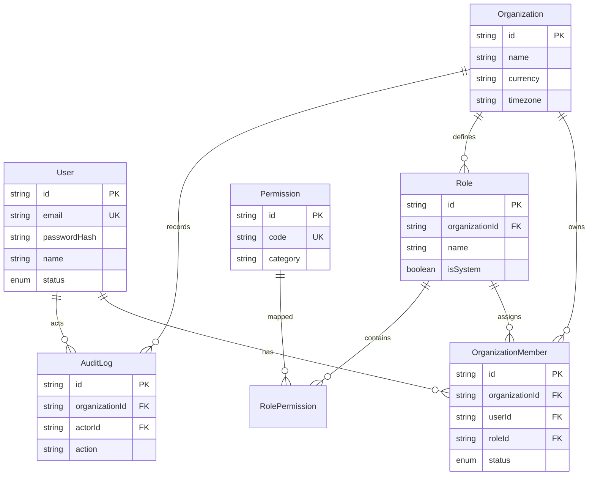

# Database & Schema Architecture

## Schema ERD Overview (Phase 1)

## Multi-Tenant Isolation Strategy
- **Shared Database, Shared Schema**: Every tenant entity is explicitly associated with an `organizationId`.
- **Query Scoping**: Server-side repository methods and `assertTenantAccess` enforce that `organizationId` matches the authenticated session's `activeOrganizationId`.
- **Foreign Key Cascade & Deletion Safeguards**: Referential integrity is enforced at the database level with explicit ON DELETE actions (Cascade/Restrict).
